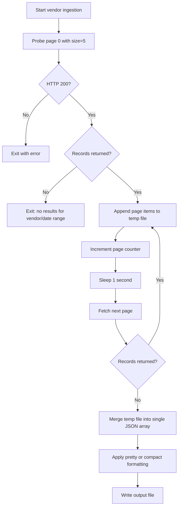
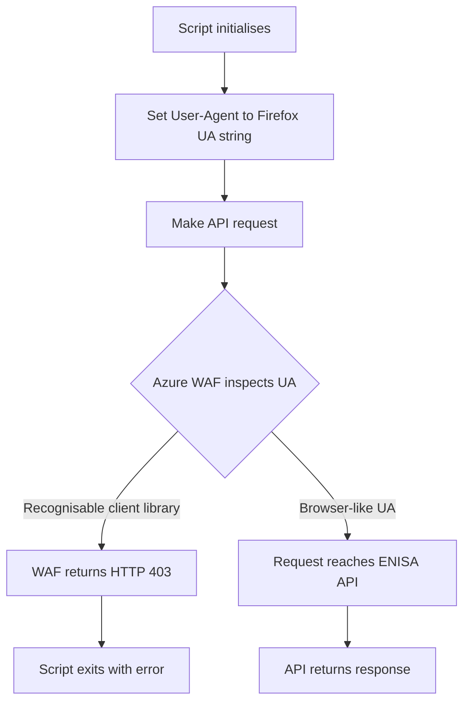

# Ingesting the Latest Vulnerabilities from the European Union Vulnerability Database (EUVD)

The European Union Agency for Cybersecurity (ENISA) maintains the [European Union Vulnerability Database (EUVD)](https://euvd.enisa.europa.eu/homepage). It is a publicly accessible vulnerability database, aggregating data from CVE, GitHub Advisory, EPSS scores and national CSIRT advisories.

Its REST API doesn't require authentication, but its endpoints for latest, latest exploited and latest critical have a maximum response of 8 records. The tool euvd_ingest.sh automates this query ingesting the response writing it on a JSON file that in the end can be formated as a pretty or compact json. 

## Prerequisites

### System Requirements

- A Unix-like shell environment; Linux, MacOS or WSL2 on Windows.
- Bash 4.0 or later.

### Required Dependencies

- `curl`- to make HTTP requests to the EUVD API
- `jq`- to parse and format the JSON output.
- `python3`- to url-encode the vendor search term

### Assumed Knowledge

- Familiarity running scripts `chmod +x` and executing from a terminal.
- Understanding of JSON structure.
- Familiarity with ISO 8601 date format (YYYY-MM-DD)

### Network Requirements

- Outbound HTTPS access to `euvdservices.enisa.europa.eu` on port 443.
- No authentication required.
- Requests must not originate from a User-Agent string identifiable as a known HTTP client library (The script handles this automatically, worth noting for anyone adapting the code).

## Installation

Make sure you meet prerequisites and clone the repo. From a Git Bash terminal, enter:
```
git clone https://github.com/rainsua/euvd-ingest.git
cd euvd-ingest
chmod +x euvd_ingest.sh
```
## Usage

To run the script, invoke it from a unix-like terminal (not from the Git Bash terminal) typing:

`./euvd_ingest.sh` 

As soon as the scrip runs you will be presented with the options below...

### Options

1) Latest 100 vulnerabilities 
2) Latest critical vulnerabilities
3) Vendor search with date range

Type 1, 2 or 3 and you'll be asked `Output format`

### Output format

1) Pretty (Outputs a human-readable JSON)
2) Compact (Outputs a minified JSON)

Type 1 for a pretty json (human readable format) or 2 for a compact json (better to save space, useful to feed an LLM etc.)

Depending on your choices the script wil query a different endpoint of the EUVD API.

#### Latest 100 vulnerabilities

Pressing `1` will query the endpoint `/api/lastvulnerabilities/` and query the endpoint for the latest vulnerabilities, paginating  them into a JSON file. The API documentation states a maximum of 8 records per response. The terminal will show the pages being ingested alongside the number of records per each. 
**To stop the response, kill the script by typing `Ctrl+C` in the Unix-like terminal. The JSON persists.**

### Flow diagram showing the pagination logic


However the endpoint didn't like the above when the user agent was an Ubuntu wsl2 terminal. The solution? Changing the user agent to Firefox...

### Diagram showing the User Agent change to Firefox




### Vendor search with date range

From date (YYYY-MM-DD, oldest boundary):

To date   (YYYY-MM-DD, most recent boundary): 

## Known Limitations

### Programmatic User-Agent strings trigger 403

The Azure WAF in front of the API blocks recognizable HTTP client libraries like curl's UA and Python's requests library. This doesn't appear to be documented. The script solves this by sending a Firefox User-Agent string.

### Response envelope differs between endpoints

`/api/lastvulnerabilities` and `/api/criticalvulnerabilities` return a bare JSON array. `/api/search` returns a wrapped object `{"items":[], "total":N}`. This is undocumented and requires separate handling in code.


