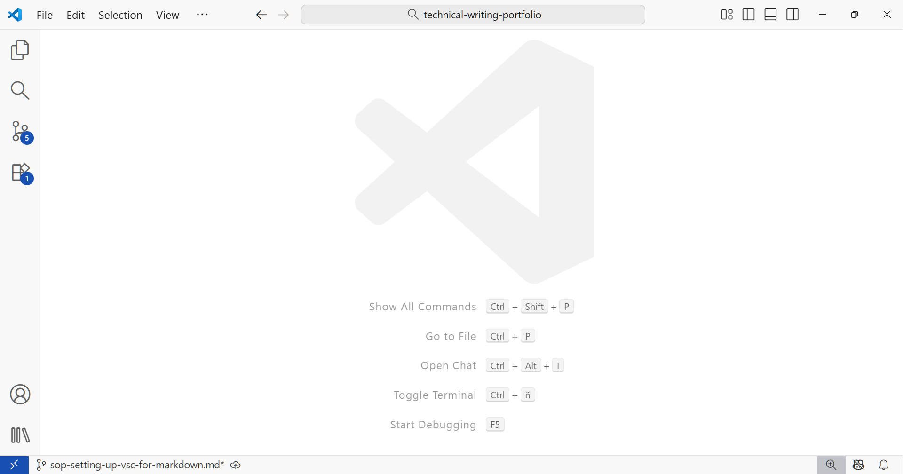
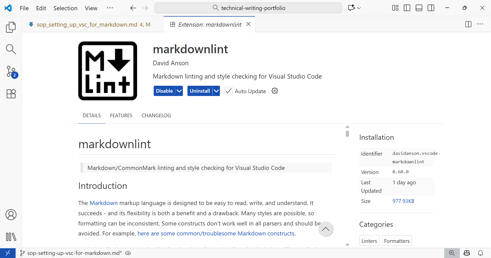
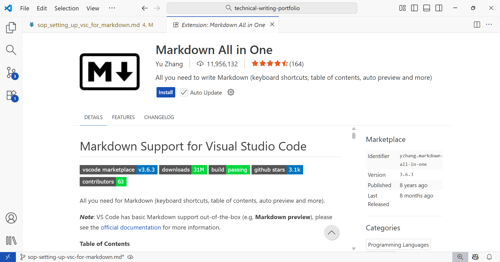
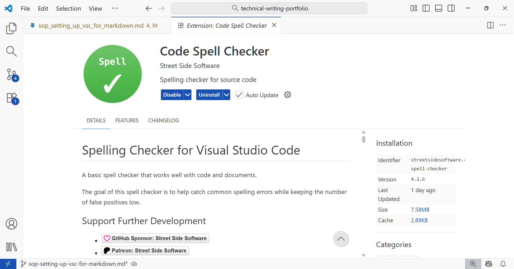
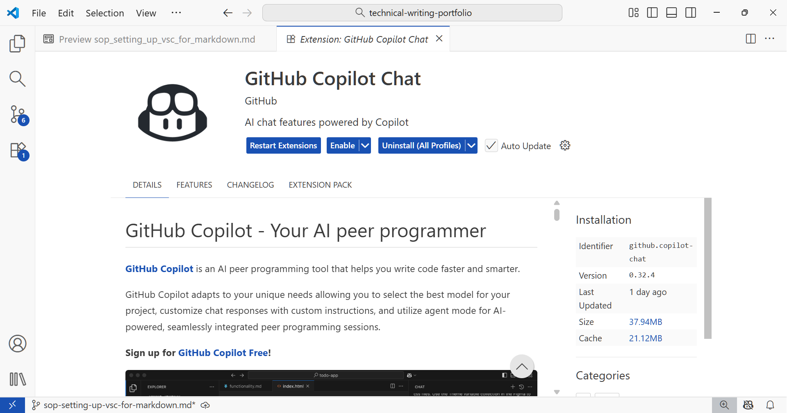

## Configuring a Minimum Viable VS Code Profile for Markdown



Follow the steps below to set up VSC for Markdown production.

## 1. Set up a new profile

Setting up a new profile is optimal. It should include only extensions useful for markdown document creation (recommended extensions below).

### To setup a new profile

a. Click the `gear`icon.

b. Click `Profile`--> `New Profile`

c. Enter a new profile name, icon, and include extensions only if they're useful for markdown production.

## 2. Install the minimum useful extensions

Three extensions are recommended as a minimalist approach. It's best to install them directly from the Marketplace in VSC, clicking on `extensions` on the left panel.

### Markdownlint



**Markdownlint** flags issues in Markdown usage and recommends actions to ensure consistent formatting.

The author is **David Anson.** The extension is safe and widely used.

### Markdown All in One



**Markdown All in One** includes "All you need in Markdown" and it is useful because VSC only includes basic Markdown support "out-of-the-box."

It adds the GitHub flavor of Markdown, along with many other useful features.

The author is **Yu Zhang** and **Markdown All in One**  is a widely used and safe extension.

### Code Spell Checker



**Code Spell Checker*** is arguably the most widely used spellchecker in VSC. It spellchecks for American and British English; British English requires looking for ``cspell.language`` in ``settings.json`` and changing the value from ``en`` to ``en-GB``.  For other languages, install the appropriate language dictionary.

The author of **Code Spell Checker** is **Street Side Software**. The extension is widely used and safe.

## 3. Disable GitHub Copilot and Telemetry(optional)


Privacy-oriented users might prefer to write documentation with GitHub's Copilot and Microsoft telemetry disabled. Since Copilot is now baked-in VSC, it's necessary to disable it in the profile to prevent it from reading your work. To disable Copilot, follow the steps below:



Disable the **GitHub Copilot Extension** on the profile as shown above and modify the settings JSON opening the *command palette* using ``Ctrl`` + ``Shif`` + ``P`` , typing ``Settings JSON`` and copy/pasting the code below:
```


{
    "chat.disableAIFeatures": true,
    "github.copilot.enable": {
        "*": false
    },
    "telemetry.telemetryLevel": "off",
    "workbench.enableExperiments": false,
    "workbench.settings.enableNaturalLanguageSearch": false
}
```
